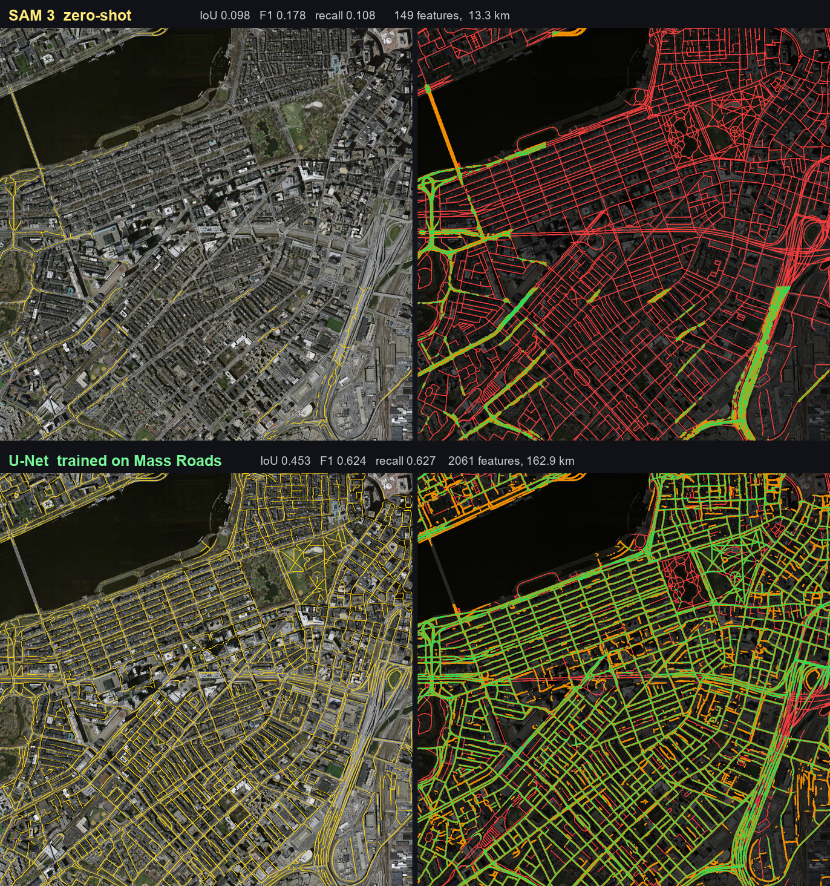

# gis-agent

**Automated road annotation on satellite imagery.**

Tracing roads off aerial imagery is normally hand work: load a raster into QGIS,
draw centrelines one by one, repeat. This automates the tracing *and* the
judgement around it — an LLM agent drives a segmentation pipeline through MCP
tools, scores its own output against ground truth, and re-runs the areas it got
wrong.

You give it a region. It gives you back road centrelines as GeoJSON, an accuracy
score, and a live view of every decision it made getting there.

---

## Contents

- [What it produces](#what-it-produces)
- [How it works](#how-it-works)
- [Install](#install)
- [First run](#first-run)
- [The web app](#the-web-app)
- [Command reference](#command-reference)
- [Results, and where it falls down](#results-and-where-it-falls-down)
- [Docker](#docker)
- [Project layout](#project-layout)
- [The supervised backend](#the-supervised-backend-this-branch)
- [Troubleshooting](#troubleshooting)

---

## What it produces

For a 3 × 3 km region near Andover, Massachusetts:

- **85 road centrelines**, 15.8 km total, as GeoJSON in WGS84 (drops straight
  into any web map) and GeoPackage in EPSG:26986
- **Accuracy against ground truth**: relaxed F1 **0.821**, recall 0.825
- A **replayable trace** of every tool call the agent made

Green is correct, orange is a false positive, red is a missed road:

```
input mosaic          extracted centrelines        agreement vs ground truth
(4 tiles, 1 m/px)     (85 features, 15.8 km)       (green / orange / red)
```

---

## How it works

```
Massachusetts Roads index
        │  filenames encode a 100 m grid, so contiguous regions are
        │  chosen without downloading anything first
        ▼
  region mosaic ......................  GeoTIFF, EPSG:26986, 1 m/px
        │  overlapped chipping
        ▼
  chips ..............................  1024 px, 128 px overlap
        │  SAM 3, text prompt "road network"
        ▼
  per-chip confidence maps ...........  float32, not hard masks
        │  feathered stitch
        ▼
  confidence.tif ──threshold──▶ mask.tif
        │  despeckle → fill holes → skeletonise
        ▼
  roads.geojson ......................  centrelines
        │
        └──▶ scored against ground truth ──▶ agent refines the weak areas
```

The agent is **not** running a fixed script. It chooses prompts, thresholds and
upscale factors, reads back measured IoU/F1, and calls `refine_area` on regions
that scored badly — the automated equivalent of an operator zooming into a bad
patch and re-tracing it.

Design decisions and their reasoning are in
[docs/architecture.md](docs/architecture.md). The short version:

| choice | why |
| --- | --- |
| `qgis_process` CLI | The popular QGIS MCP servers need a **Desktop GUI** with a human clicking "Start Server". That can't be containerised or driven from a web backend. |
| SAM 3, not SAM 1/2 | SAM 3 takes a **text prompt**. SAM 1/2 only take points and boxes, so roads mean generating blobs and guessing which are roads. |
| Confidence maps, not masks | Chips overlap and must blend. Keeping float confidence means the threshold can be swept **without re-running inference**, by far the slowest step. |

---

## Install

**Requirements**

| | |
| --- | --- |
| Python | 3.12 or 3.13 |
| [uv](https://docs.astral.sh/uv/) | package manager |
| QGIS | any 3.x — only the bundled `qgis_process` CLI is used, and it is auto-detected |
| GPU | optional but strongly recommended; ~4 GB VRAM is enough |

```bash
git clone https://github.com/blessondavis/gis-agent.git
cd gis-agent
uv sync --extra dev
```

**Two credentials**, both in a `.env` file (git-ignored):

```bash
cp .env.example .env
```

| variable | how to get it |
| --- | --- |
| `HF_TOKEN` | `facebook/sam3` is **gated** — accept the terms at [huggingface.co/facebook/sam3](https://huggingface.co/facebook/sam3), then make a read token at [settings/tokens](https://huggingface.co/settings/tokens) |
| `OPENAI_API_KEY` + `OPENAI_BASE_URL` | any OpenAI-compatible endpoint. NVIDIA NIM, OpenAI, vLLM, Groq, OpenRouter all work |

The model must support **tool calling**, or the agent cannot do anything. Verified
working on NVIDIA NIM: `nvidia/nemotron-3-super-120b-a12b` and `openai/gpt-oss-20b`.

**Check everything before going further:**

```bash
uv run gisagent doctor
```

```
component   status  detail
torch       ok      2.11.0+cu128 cuda=12.8 RTX 5050 sm_120 8.5 GB
qgis        ok      QGIS 3.44.14-Solothurn
sam model   ok      facebook/sam3 (token set)
llm         ok      nvidia/nemotron-3-super-120b-a12b
```

`doctor` sends a real tool-call probe, not just an auth check — a model that
authenticates but can't call tools would otherwise fail silently much later.

---

## First run

Three commands, start to finish:

```bash
# 1. find a region worth annotating (ranked by road density, cached after first run)
uv run gisagent regions --split train --size 2

# 2. download those tiles and mosaic them into a job
uv run gisagent build 22529485_15 22679485_15 22529470_15 22679470_15 --name andover

# 3. segment → stitch → vectorise → score
uv run gisagent run <job-id>
```

`run` prints a metrics table and the path to `roads.geojson`.

> **First run downloads ~3.4 GB of SAM 3 weights.** Subsequent runs reuse the
> Hugging Face cache.

---

## The web app

```bash
uv run gisagent serve
```

Then open <http://127.0.0.1:8000>. One page, three columns:

| column | what it does |
| --- | --- |
| **left** | pick a region, toggle layers, watch accuracy and vector stats update |
| **centre** | Leaflet map — imagery, predicted mask, ground truth, centrelines. Drag a box to target a rework |
| **right** | talk to the agent, and watch each tool call stream in as it happens |

Ask it things like *"annotate the roads in this region"*, *"try to improve the
score"*, or *"which roads are least confident?"*. Select an area on the map and
tell it what's wrong there, and it will re-run just those chips.

Leaflet is vendored locally — no CDN, no Node, no build step.

---

## Command reference

| command | purpose |
| --- | --- |
| `gisagent doctor` | verify GPU, QGIS, SAM 3 access and LLM tool calling |
| `gisagent regions` | rank contiguous tile blocks by road density |
| `gisagent build <tiles...>` | download tiles and mosaic them into a job |
| `gisagent run <job-id>` | full pipeline with metrics |
| `gisagent jobs` | list jobs, newest first |
| `gisagent serve` | run the web app |
| `gisagent mcp` | expose the 16 MCP tools on stdio, for an external client |

Add `--help` to any of them.

### Using the MCP tools from another client

`gisagent mcp` speaks MCP over stdio, so Claude Desktop or any other MCP client
can drive the pipeline directly:

| group | tools |
| --- | --- |
| discovery | `list_available_tiles`, `list_jobs`, `get_job_status` |
| region | `create_region_job`, `tile_region`, `inspect_chip` |
| inference | `segment_chips`, `stitch_result`, `refine_area` |
| quality | `evaluate_result`, `sweep_threshold`, `low_confidence_roads` |
| vector | `vectorize_result` |
| QGIS | `qgis_version`, `list_qgis_algorithms`, `run_qgis_algorithm` |

That last group is an escape hatch: rather than wrapping every algorithm, the
agent can list and call any of the 712 QGIS algorithms directly.

---

## Results, and where it falls down

Measured against the dataset's own ground-truth masks. **Relaxed** allows 3 px of
slack, which is roughly the disagreement between two human annotators tracing the
same road.

| region | road density | IoU | F1 | relaxed F1 | recall |
| --- | --- | --- | --- | --- | --- |
| Andover (suburban) | 1.2 % | 0.460 | 0.631 | **0.821** | 0.825 |
| Boston Back Bay (urban) | 15.9 % | 0.098 | 0.178 | 0.217 | **0.108** |

**Read the second row before trusting this on your own data.** Zero-shot SAM 3
degrades badly on dense urban street grids. It finds the arterials and the
highway and misses most of the residential grid: at 1 m/px those streets are
~10–15 px wide, shadowed by buildings and lined with parked cars, and a concept
model reads them as texture between rooftops. Precision holds up (0.51), so what
it *does* find is real — it just misses about 90 % of it.

Other limits worth knowing:

- Parking lots, driveways and wide paths read as road. Precision is the weak axis
  everywhere.
- Strict IoU understates quality — centreline placement is a few pixels off more
  often than roads are actually missed. That's why relaxed metrics are reported
  alongside.
- Ground truth exists only for the Massachusetts tiles. Uploaded imagery runs the
  same pipeline but cannot be scored.

A supervised model trained on this dataset addresses the urban failure directly —
see [the supervised backend](#the-supervised-backend-this-branch) below.

---

## Docker

```bash
docker compose -f docker/docker-compose.yml up --build
```

Built on the official `qgis/qgis` image for the headless `qgis_process` CLI.
Defaults to CPU torch; for GPU set `TORCH_VARIANT: cu128` in the compose file and
uncomment the `deploy.resources` block (needs `nvidia-container-toolkit`).

> ⚠️ **Not yet verified end to end** — Docker isn't installed on the development
> machine. The image definition is complete but untested.

---

## Project layout

```
src/gisagent/
  dataset/mass_roads.py   tile index, grid decoding, screening, download
  raster/                 georeferencing, chipping, stitching, previews
  segment/sam3.py         SAM 3 promptable concept segmentation
  vector/roads.py         morphology → skeleton → centreline GeoJSON
  evaluate/metrics.py     IoU / precision / recall / F1, strict and relaxed
  qgis/process.py         headless qgis_process wrapper
  mcp_servers/            16 MCP tools over the pipeline
  agent/loop.py           OpenAI-compatible tool-calling loop
  api/app.py              FastAPI + WebSocket
  pipeline.py             Job: stages, artefacts, manifest
web/                      single-page workspace, no build step
docker/                   Dockerfile + compose
```

Run the tests with `uv run pytest` (55 tests, no network or GPU required).

---

## The supervised backend (this branch)

> You are on **`supervised-unet`**. `main` is the zero-shot SAM 3 application;
> this branch adds a second segmentation backend trained on the dataset's own
> labels, plus the training pipeline and a `benchmark` command.

### Why

The urban failure above is not a tuning problem. SAM 3 is a *concept* model: it
was never shown what a road looks like from 400 m up, and a narrow shadowed
street between rooftops does not read as one. The Massachusetts Roads dataset
contains exactly that supervision — 1,171 tiles of labelled roads at 1 m/px — so
the fix is to use it.

### Not a SAM 3 fine-tune

This trains a **ResNet-34 U-Net (24 M params) from scratch** (ImageNet encoder),
not a fine-tune of SAM 3. Two reasons:

1. SAM 3 is 0.9 B parameters. Fine-tuning it needs far more than 8 GB of VRAM.
2. It wouldn't help as much. The failure is that the model doesn't know what an
   aerial road is — a small model learning that from scratch on 160 tiles is a
   better use of the same GPU-hour.

### Train one

```bash
uv run gisagent train --tiles 160 --epochs 14
```

This downloads a curated training set (~1.4 GB), trains, and writes
`models/unet_roads.pt` plus a `train_report.json`. Tiles are chosen from the
screening cache to span the useful road-density range — tiles with almost no
road cost disk without teaching anything, and downtown blocks where the labels
paint wide swathes skew the model towards predicting road everywhere.

Two details in the data pipeline matter more than they look:

- **Crops are biased towards windows containing road.** Roads are a few percent
  of pixels, so uniformly random crops are mostly empty and the model learns to
  predict background everywhere.
- **Blank-heavy crops are rejected.** Many tiles are edge-of-coverage and carry
  white no-data padding; training on it teaches that white means background.

Reuse an existing download with `--skip-fetch`.

### Use it

```bash
uv run gisagent run <job-id> --model unet
```

`UNetRoadSegmenter` implements the same interface as `Sam3RoadSegmenter`, so the
pipeline, the MCP tools and the web app are all unchanged by the choice. Two
honest differences, both inherent to a supervised model:

- `prompt` is accepted and **ignored** — there is no text conditioning.
- `n_instances` is 1 when anything is found. This is semantic, not instance,
  segmentation.

### Compare them

```bash
uv run gisagent benchmark <suburban-job> <urban-job> --models sam3,unet
```

Segments, stitches and scores each backend on each job, then prints them side by
side. It skips vectorising, which costs time without changing the pixel metrics
under comparison.

### Measured result



Same regions, same pipeline, same threshold — only the backend differs. Trained
for 9.9 minutes on 135 tiles on an RTX 5050 (val IoU 0.608 at epoch 13).

| region | road % | model | IoU | F1 | precision | recall | relaxed F1 |
| --- | --- | --- | --- | --- | --- | --- | --- |
| Andover (suburban) | 1.1 | sam3 | 0.455 | 0.626 | 0.497 | 0.844 | 0.822 |
| Andover (suburban) | 1.1 | **unet** | **0.581** | **0.735** | 0.642 | 0.860 | 0.857 |
| Boston (urban) | 15.9 | sam3 | 0.098 | 0.178 | 0.511 | 0.108 | 0.217 |
| Boston (urban) | 15.9 | **unet** | **0.453** | **0.624** | 0.621 | **0.627** | 0.791 |

The urban case is where it matters: **IoU 4.6×, recall 5.8×**. In vector terms
the same region goes from 149 centrelines totalling 13.3 km to 2,061 totalling
162.9 km — SAM 3 was finding the arterials and almost none of the grid.

Suburban improves too (+28 % IoU), so this is not a trade of one case for the
other. Precision is the axis that gains most (0.497 → 0.642): a supervised model
has actually learned that a parking lot is not a road, which no amount of prompt
wording teaches a concept model.

Worth being clear about what this is not: 135 tiles and ten minutes is a small
model on a small budget. Published work on this dataset reaches higher. The
point here is that the *failure mode is fixable with supervision*, and that
swapping backends changes nothing else in the system.

### Extra layout on this branch

```
src/gisagent/train/
  fetch.py     choose and download a training set from the density cache
  data.py      road-biased random crops, blank rejection, augmentation
  loop.py      BCE + Dice, AMP, cosine schedule, best-IoU checkpointing
src/gisagent/segment/
  unet.py      sliding-window inference with a cosine taper
  __init__.py  make_segmenter("sam3" | "unet")
```

---

## Troubleshooting

**`doctor` says the LLM "responds, but did NOT emit a tool call"**
The model can't call tools. Pick another — on NVIDIA NIM many catalogue entries
return 404 unless enabled for your account.

**`CUDA error: no kernel image is available`**
RTX 50-series (Blackwell, `sm_120`) needs CUDA 12.8+ wheels. `pyproject.toml`
already pins the `cu128` index; if you installed torch another way, reinstall
from `https://download.pytorch.org/whl/cu128`.

**`qgis_process not found on PATH`**
Set `GISAGENT_QGIS_PROCESS` in `.env` to the full path. On Windows it's usually
`C:\Program Files\QGIS <version>\bin\qgis_process-qgis-ltr.bat`.

**`failed to hardlink file ... os error 396`**
uv's cache can't hardlink across OneDrive. Use `uv sync --link-mode=copy`.

**Region looks mostly blank**
Some tiles are at the edge of the survey area and are largely white no-data.
`gisagent regions` ranks alternatives; `build` warns when the tiles it fetched
are mostly padding.

---

## Data

[Massachusetts Roads Dataset](https://www.cs.toronto.edu/~vmnih/data/) (Mnih,
2013). 1,171 aerial tiles, GeoTIFF in EPSG:26986 at 1 m/px, 1500 × 1500 px, with
ground-truth road masks. Released for research use.
