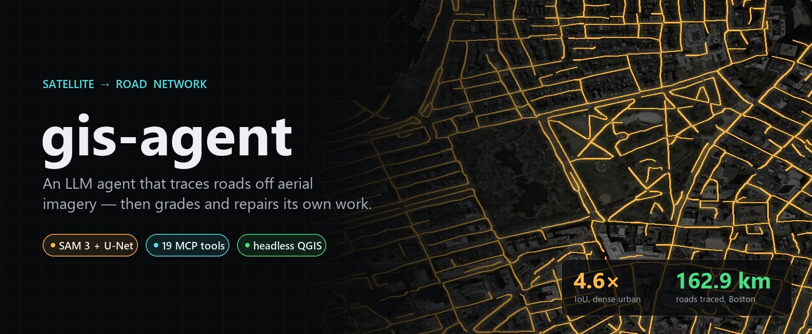
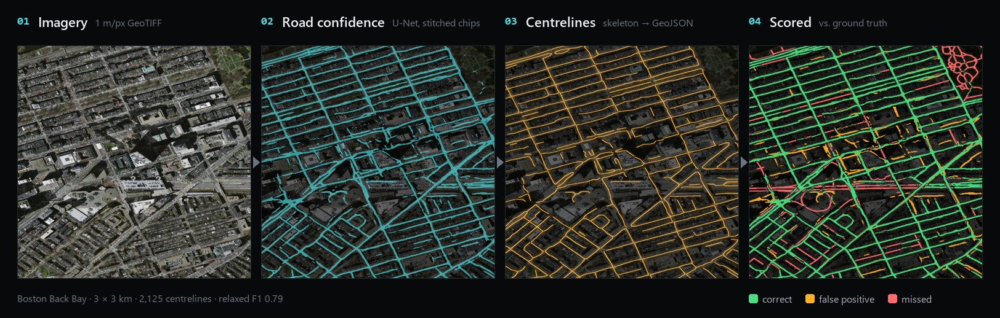
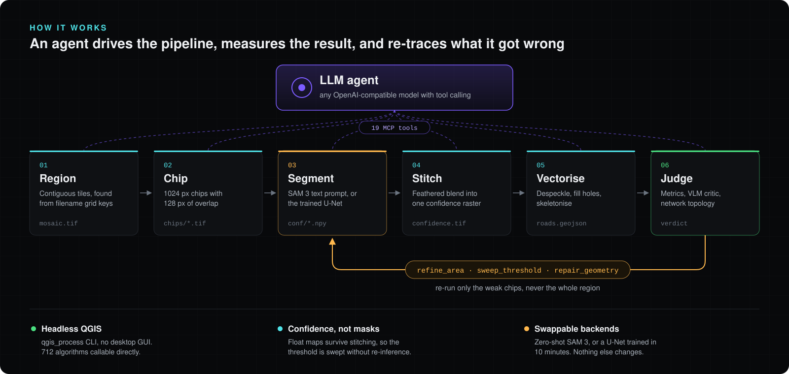
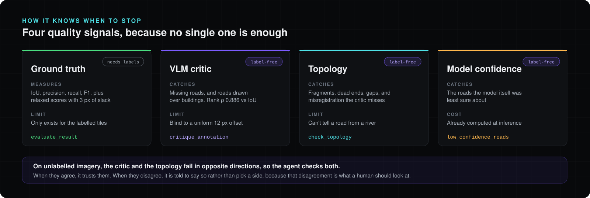
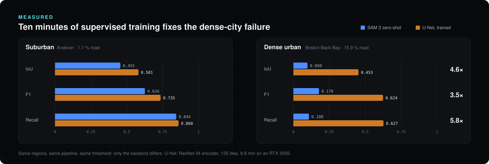

<p align="center">
  
</p>

<p align="center">
  <a href="#-quickstart"></a>
  <a href="https://modelcontextprotocol.io"></a>
  <a href="https://huggingface.co/facebook/sam3"></a>
  <a href="https://qgis.org"></a>
  <a href="https://pytorch.org"></a>
  <a href="https://github.com/blessondavis/gis-agent/stargazers"></a>
</p>

<p align="center">
  <b><a href="#-quickstart">Quickstart</a></b> ·
  <b><a href="#-how-it-works">How it works</a></b> ·
  <b><a href="#-results">Results</a></b> ·
  <b><a href="#-mcp-tools">MCP tools</a></b> ·
  <b><a href="docs/architecture.md">Architecture</a></b> ·
  <b><a href="docs/vlm-critic.md">VLM critic study</a></b>
</p>

---

Tracing roads off aerial imagery is normally hand work: load a raster into QGIS,
draw centrelines one by one, repeat. **gis-agent automates the tracing *and* the
judgement around it.** An LLM agent drives a segmentation pipeline through MCP
tools, scores its own output, and re-runs the areas it got wrong.

You give it a region. It gives you back **road centrelines as GeoJSON**, an
**accuracy score**, and a **live trace** of every decision it made on the way.

<table>
  <tr>
    <td width="33%" valign="top">
      <h3>🤖 An agent, not a script</h3>
      It picks prompts, thresholds and upscale factors, reads back measured
      scores, and re-traces only the weak chips. It works the way an operator
      zooms into a bad patch.
    </td>
    <td width="33%" valign="top">
      <h3>🧭 Judges itself without labels</h3>
      A vision-model critic, network topology and model confidence tell it
      when it's done, even on imagery nobody has annotated.
    </td>
    <td width="33%" valign="top">
      <h3>🗺️ Real GIS output</h3>
      WGS84 GeoJSON for web maps, GeoPackage in the source CRS, and headless
      QGIS with all 712 algorithms callable directly.
    </td>
  </tr>
</table>

## 🛰️ See it work

<p align="center">
  
</p>

One real 3 × 3 km run over Boston Back Bay: **2,125 centrelines** extracted and
scored against the dataset's ground truth at **relaxed F1 0.79**. Green is
correct, orange is a false positive, red is a missed road.

---

## 🔧 How it works

<p align="center">
  
</p>

The agent is **not** running a fixed script. It chooses prompts, thresholds and
upscale factors, reads back measured IoU/F1, and calls `refine_area` on regions
that scored badly.

<details>
<summary><b>The pipeline, stage by stage</b></summary>

```
Massachusetts Roads index
        │  filenames encode a 100 m grid, so contiguous regions are
        │  chosen without downloading anything first
        ▼
  region mosaic ......................  GeoTIFF, EPSG:26986, 1 m/px
        │  overlapped chipping
        ▼
  chips ..............................  1024 px, 128 px overlap
        │  SAM 3 ("road network") or the trained U-Net
        ▼
  per-chip confidence maps ...........  float32, not hard masks
        │  feathered stitch
        ▼
  confidence.tif ──threshold──▶ mask.tif
        │  despeckle → fill holes → skeletonise
        ▼
  roads.geojson ......................  centrelines
        │
        └──▶ judged (metrics / critic / topology) ──▶ agent refines the weak areas
```

</details>

The full reasoning behind each design decision is in
[docs/architecture.md](docs/architecture.md). The short version:

| choice | why |
| --- | --- |
| `qgis_process` CLI | The popular QGIS MCP servers need a **Desktop GUI** with a human clicking "Start Server". That can't be containerised or driven from a web backend. |
| SAM 3, not SAM 1/2 | SAM 3 takes a **text prompt**. SAM 1/2 only take points and boxes, so roads mean generating blobs and guessing which are roads. |
| Confidence maps, not masks | Chips overlap and must blend. Keeping float confidence means the threshold can be swept **without re-running inference**, which is by far the slowest step. |
| Swappable segmenters | `UNetRoadSegmenter` and `Sam3RoadSegmenter` share one interface, so the pipeline, MCP tools and web app don't care which one runs. |

---

## 🧭 How it knows when to stop

<p align="center">
  
</p>

Ground truth only exists for the benchmark tiles. On real work there is none, so
something else has to tell the loop whether an annotation is good enough.

That "something" was **tested before it was built on.** Six overlays of known
quality were shown blind to a vision model, which ranked them at **Spearman
ρ = +0.886** against true IoU. It also exposed a blind spot: a uniformly shifted
annotation still *looks* right. Topology catches exactly that case, so the two
ship together. The full study is in [docs/vlm-critic.md](docs/vlm-critic.md).

---

## 📊 Results

<p align="center">
  
</p>

Measured against the dataset's own ground-truth masks. **Relaxed** allows 3 px of
slack, roughly the disagreement between two human annotators tracing the same
road.

| region | road % | model | IoU | F1 | precision | recall | relaxed F1 |
| --- | --- | --- | --- | --- | --- | --- | --- |
| Andover (suburban) | 1.1 | sam3 | 0.455 | 0.626 | 0.497 | 0.844 | 0.822 |
| Andover (suburban) | 1.1 | **unet** | **0.581** | **0.735** | 0.642 | 0.860 | 0.857 |
| Boston (urban) | 15.9 | sam3 | 0.098 | 0.178 | 0.511 | 0.108 | 0.217 |
| Boston (urban) | 15.9 | **unet** | **0.453** | **0.624** | 0.621 | **0.627** | 0.791 |

In the urban case, **IoU improves 4.6× and recall 5.8×**. In vector terms the
same region goes from 149 centrelines totalling 13.3 km to 2,061 totalling
162.9 km. SAM 3 was finding the arterials and almost none of the grid.

<details>
<summary><b>🔍 Side by side on Boston Back Bay (full-resolution comparison)</b></summary>
<br>


Top: zero-shot SAM 3. Bottom: the trained U-Net. Left is the extracted network,
right is agreement with ground truth.

</details>

### Where it falls down

- **Zero-shot SAM 3 degrades badly on dense street grids.** At 1 m/px, residential
  streets are ~10–15 px wide, shadowed by buildings and lined with parked cars,
  and a concept model reads them as texture between rooftops. What it *does* find
  is real (precision 0.51); it just misses about 90 % of it. The U-Net exists to
  fix this.
- **Parking lots, driveways and wide paths read as road.** Precision is the weak
  axis everywhere, though supervision helps (0.497 → 0.642 in the suburbs).
- **Strict IoU understates quality.** Centreline placement is a few pixels off
  more often than roads are actually missed, which is why relaxed metrics are
  reported alongside.
- **Only the Massachusetts tiles can be scored.** Uploaded imagery runs the same
  pipeline and gets the label-free signals, but no IoU.
- **135 tiles and ten minutes is a small budget.** Published work on this dataset
  reaches higher. The point is that the failure mode is fixable with supervision,
  and that swapping backends changes nothing else in the system.

---

## 🚀 Quickstart

**Requirements:** Python 3.12 or 3.13 · [uv](https://docs.astral.sh/uv/) ·
QGIS 3.x (only the bundled `qgis_process` CLI is used, and it's auto-detected) ·
a GPU is optional but strongly recommended (~4 GB VRAM is enough).

```bash
git clone https://github.com/blessondavis/gis-agent.git
cd gis-agent
uv sync --extra dev
cp .env.example .env        # then fill in the two credentials below
```

| variable | how to get it |
| --- | --- |
| `HF_TOKEN` | `facebook/sam3` is **gated**. Accept the terms at [huggingface.co/facebook/sam3](https://huggingface.co/facebook/sam3), then make a read token at [settings/tokens](https://huggingface.co/settings/tokens) |
| `OPENAI_API_KEY` + `OPENAI_BASE_URL` | any OpenAI-compatible endpoint: NVIDIA NIM, OpenAI, vLLM, Groq and OpenRouter all work |

The model must support **tool calling**, or the agent can't do anything. Verified
working on NVIDIA NIM: `nvidia/nemotron-3-super-120b-a12b` and `openai/gpt-oss-20b`.

**Check everything before going further:**

```console
$ uv run gisagent doctor
component   status  detail
torch       ok      2.11.0+cu128 cuda=12.8 RTX 5050 sm_120 8.5 GB
qgis        ok      QGIS 3.44.14-Solothurn
sam model   ok      facebook/sam3 (token set)
llm         ok      nvidia/nemotron-3-super-120b-a12b
```

`doctor` sends a real tool-call probe, not just an auth check. Without it, a model
that authenticates but can't call tools would fail silently much later.

**Then three commands, start to finish:**

```bash
# 1. find a region worth annotating (ranked by road density, cached after first run)
uv run gisagent regions --split train --size 2

# 2. download those tiles and mosaic them into a job
uv run gisagent build 22529485_15 22679485_15 22529470_15 22679470_15 --name andover

# 3. segment → stitch → vectorise → score
uv run gisagent run <job-id>
```

`run` prints a metrics table and the path to `roads.geojson`.

> [!NOTE]
> The first SAM 3 run downloads **~3.4 GB of weights**. Later runs reuse the
> Hugging Face cache.

---

## 🖥️ The web app

```bash
uv run gisagent serve        # → http://127.0.0.1:8000
```

One page, three columns:

| column | what it does |
| --- | --- |
| **left** | pick a region, toggle layers, watch accuracy, vector stats and the quality verdict update |
| **centre** | Leaflet map with imagery, predicted mask, ground truth and centrelines. Drag a box to target a rework |
| **right** | talk to the agent and watch each tool call stream in as it happens |

Ask it things like *"annotate the roads in this region"*, *"try to improve the
score"*, or *"which roads are least confident?"* Select an area on the map, tell
it what's wrong there, and it re-runs just those chips.

Leaflet is vendored locally, so there's no CDN, no Node and no build step.

---

## 🔌 MCP tools

`gisagent mcp` speaks MCP over stdio, so Claude Desktop or any other MCP client
can drive the pipeline directly.

| group | tools |
| --- | --- |
| 🔎 discovery | `list_available_tiles`, `list_jobs`, `get_job_status` |
| 🧩 region | `create_region_job`, `tile_region`, `inspect_chip` |
| 🧠 inference | `segment_chips`, `stitch_result`, `refine_area` |
| 📏 quality, with labels | `evaluate_result`, `sweep_threshold`, `low_confidence_roads` |
| 🧭 quality, label-free | `critique_annotation`, `check_topology` |
| 🗺️ vector | `vectorize_result`, `repair_geometry` |
| 🛠️ QGIS | `qgis_version`, `list_qgis_algorithms`, `run_qgis_algorithm` |

The QGIS group is an escape hatch. Rather than wrapping every algorithm, the agent
can list and call any of the 712 QGIS algorithms directly. `repair_geometry`
reports topology **before and after** each fix (snap, remove dangles, extend,
simplify, smooth), so the agent can check that a repair actually helped instead
of assuming it did.

## 🧰 Commands

| command | purpose |
| --- | --- |
| `gisagent doctor` | verify GPU, QGIS, SAM 3 access and LLM tool calling |
| `gisagent regions` | rank contiguous tile blocks by road density |
| `gisagent build <tiles...>` | download tiles and mosaic them into a job |
| `gisagent run <job-id>` | full pipeline with metrics; `--model sam3\|unet` |
| `gisagent train` | train the U-Net on Massachusetts Roads labels |
| `gisagent benchmark <jobs...>` | score backends against each other |
| `gisagent jobs` | list jobs, newest first |
| `gisagent serve` | run the web app |
| `gisagent mcp` | expose the 19 MCP tools on stdio, for an external client |

Add `--help` to any of them.

---

## 🧠 The supervised backend

Two backends ship together: zero-shot **SAM 3**, and a **U-Net trained on the
dataset's own labels**. The trained one is better everywhere and much better in
dense cities, and it is the default (`GISAGENT_BACKEND=unet`).

```bash
uv run gisagent train --tiles 160 --epochs 14      # ~1.4 GB download, ~10 min on an RTX 5050
uv run gisagent run <job-id> --model unet
uv run gisagent benchmark <suburban-job> <urban-job> --models sam3,unet
```

<details>
<summary><b>Why a U-Net, and not a SAM 3 fine-tune</b></summary>
<br>

The urban failure is not a tuning problem. SAM 3 is a *concept* model: it was
never shown what a road looks like from 400 m up, and a narrow shadowed street
between rooftops does not read as one. The Massachusetts Roads dataset contains
exactly that supervision (1,171 tiles of labelled roads at 1 m/px), so the fix is
to use it.

This trains a **ResNet-34 U-Net (24 M params) from scratch** with an ImageNet
encoder, not a fine-tune of SAM 3. There are two reasons:

1. SAM 3 is 0.9 B parameters. Fine-tuning it needs far more than 8 GB of VRAM.
2. It wouldn't help as much. The failure is that the model doesn't know what an
   aerial road is, and a small model learning that from scratch on 160 tiles is a
   better use of the same GPU-hour.

</details>

<details>
<summary><b>Training details that matter more than they look</b></summary>
<br>

`train` writes `models/unet_roads.pt` plus a `train_report.json`. Tiles are chosen
from the screening cache to span the useful road-density range. Near-empty tiles
cost disk without teaching anything, and downtown blocks where the labels paint
wide swathes skew the model towards predicting road everywhere.

- **Crops are biased towards windows containing road.** Roads are a few percent
  of pixels, so uniformly random crops are mostly empty and the model learns to
  predict background everywhere.
- **Blank-heavy crops are rejected.** Many tiles are edge-of-coverage and carry
  white no-data padding. Training on it teaches that white means background.

The measured run trained for 9.9 minutes on 135 tiles (val IoU 0.608 at epoch 13).
Reuse an existing download with `--skip-fetch`.

`UNetRoadSegmenter` has two honest differences from SAM 3, both inherent to a
supervised model:

- `prompt` is accepted and **ignored**, because there is no text conditioning.
- `n_instances` is 1 when anything is found. This is semantic, not instance,
  segmentation.

</details>

---

## 🐳 Docker

```bash
docker compose -f docker/docker-compose.yml up --build
```

Built on the official `qgis/qgis` image for the headless `qgis_process` CLI.
Defaults to CPU torch. For GPU, set `TORCH_VARIANT: cu128` in the compose file
and uncomment the `deploy.resources` block (needs `nvidia-container-toolkit`).

> [!WARNING]
> **Not yet verified end to end.** Docker isn't installed on the development
> machine, so the image definition is complete but untested.

---

## 📁 Project layout

```
src/gisagent/
  dataset/mass_roads.py   tile index, grid decoding, screening, download
  raster/                 georeferencing, chipping, stitching, previews
  segment/                SAM 3 concept segmentation, U-Net sliding-window inference
  train/                  training-set selection, road-biased crops, training loop
  vector/roads.py         morphology → skeleton → centreline GeoJSON
  vector/topology.py      label-free network scoring: components, dangles, gaps
  critic/vlm.py           vision-model critic for unlabelled imagery
  evaluate/metrics.py     IoU / precision / recall / F1, strict and relaxed
  qgis/process.py         headless qgis_process wrapper
  mcp_servers/            19 MCP tools over the pipeline
  agent/loop.py           OpenAI-compatible tool-calling loop
  api/app.py              FastAPI + WebSocket
  pipeline.py             Job: stages, artefacts, manifest
web/                      single-page workspace, no build step
docker/                   Dockerfile + compose
docs/                     architecture, VLM critic study, design brief
```

Run the tests with `uv run pytest` (66 tests, no network or GPU required).

---

## 🛠️ Troubleshooting

<details>
<summary><code>doctor</code> says the LLM "responds, but did NOT emit a tool call"</summary>
<br>
The model can't call tools, so pick another. On NVIDIA NIM, many catalogue
entries return 404 unless they're enabled for your account.
</details>

<details>
<summary><code>CUDA error: no kernel image is available</code></summary>
<br>
RTX 50-series (Blackwell, <code>sm_120</code>) needs CUDA 12.8+ wheels.
<code>pyproject.toml</code> already pins the <code>cu128</code> index. If you
installed torch another way, reinstall from
<code>https://download.pytorch.org/whl/cu128</code>.
</details>

<details>
<summary><code>qgis_process not found on PATH</code></summary>
<br>
Set <code>GISAGENT_QGIS_PROCESS</code> in <code>.env</code> to the full path. On
Windows it's usually
<code>C:\Program Files\QGIS &lt;version&gt;\bin\qgis_process-qgis-ltr.bat</code>.
</details>

<details>
<summary><code>failed to hardlink file ... os error 396</code></summary>
<br>
uv's cache can't hardlink across OneDrive. Use
<code>uv sync --link-mode=copy</code>.
</details>

<details>
<summary>The region looks mostly blank</summary>
<br>
Some tiles sit at the edge of the survey area and are largely white no-data.
<code>gisagent regions</code> ranks alternatives, and <code>build</code> warns
when the tiles it fetched are mostly padding.
</details>

---

## 📚 Data

[Massachusetts Roads Dataset](https://www.cs.toronto.edu/~vmnih/data/) (Mnih,
2013): 1,171 aerial tiles, GeoTIFF in EPSG:26986 at 1 m/px, 1500 × 1500 px, with
ground-truth road masks. Released for research use.

## ⭐ Star history

<a href="https://star-history.com/#blessondavis/gis-agent&Date">
  <picture>
    <source media="(prefers-color-scheme: dark)" srcset="https://api.star-history.com/svg?repos=blessondavis/gis-agent&type=Date&theme=dark">
    
  </picture>
</a>

<p align="center">
  <sub>If this saved you an afternoon of tracing roads by hand, a ⭐ helps other people find it.</sub>
</p>
